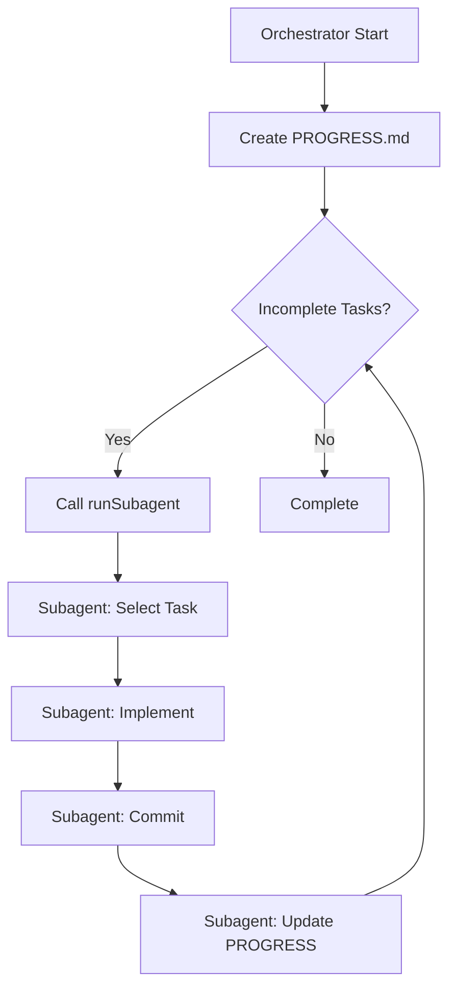

# Ralph Wiggum Technique Guide

## Table of Contents
1. [Introduction](#introduction)
2. [Core Concepts](#core-concepts)
3. [Project Structure](#project-structure)
4. [File Formats](#file-formats)
5. [Usage](#usage)
6. [Prompt Engineering](#prompt-engineering)
7. [Cost Savings](#cost-savings)
8. [Best Practices](#best-practices)
9. [Troubleshooting](#troubleshooting)

---

## Introduction

The **Ralph Wiggum Technique** is an orchestration pattern that leverages VS Code Copilot Chat's `runSubagent` tool to automatically implement large-scale projects.

### Core Idea

- **Orchestrator**: Main agent using Opus model. Manages the entire workflow and calls subagents sequentially
- **Subagents**: Each runs independently and implements a single task
- **State Sharing**: Progress tracked through `PROGRESS.md` file

### Why Use This Technique?

1. **Cost Savings**: Orchestrator = 1 premium request, `runSubagent` calls = no additional charges
2. **Context Isolation**: Each subagent is independent → prevents "message too big" errors
3. **Stability**: If a subagent fails, orchestrator can retry
4. **Traceability**: All progress logged to files

---

## Core Concepts

### 3-Component System

```
PLAN.md         → Full project specification (Single Source of Truth)
tasks/*.md      → Individual task definitions (with dependencies, acceptance criteria)
PROGRESS.md     → Real-time progress tracking (Orchestrator ↔ Subagent communication)
```

### Workflow



---

## Project Structure

### Folder Layout

```
project-root/
├── .ai/                              # Orchestrator meta files
│   ├── PLAN.md                       # PRD - Project specification
│   ├── PROGRESS.md                   # Progress tracking (auto-generated/updated)
│   ├── PROMPT_ORCHESTRATOR.md        # Orchestrator prompt template
│   ├── PROMPT_SUBAGENT.md            # Subagent prompt template
│   ├── GUIDE.md                      # This guide (Korean)
│   ├── GUIDE-EN.md                   # This guide (English)
│   └── tasks/                        # Task breakdown
│       ├── TASK-01-topic.md
│       ├── TASK-02-topic.md
│       └── ...
│
├── src/                              # Actual app code (created by subagents)
│   └── ...
│
└── (other project files)
```

### File Roles

| File | Role | Created By | Updated By |
|------|------|------------|------------|
| `PLAN.md` | Full project requirements | User/Claude | - |
| `tasks/*.md` | Individual task specifications | User/Claude | - |
| `PROGRESS.md` | Real-time progress | Orchestrator | Subagents |
| `PROMPT_*.md` | Prompt templates | User | - |

---

## File Formats

### 1. PLAN.md (PRD)

The project's **single source of truth**. Document for subagents to understand context.

```markdown
# {Project Name} — Product Requirements Document

## Overview
{Project overview and purpose}

## Tech Stack
- Runtime: ...
- Language: ...
- Framework: ...

## Data Model
{Core data structures}

## Functional Requirements
### Commands/Features
| Feature | Description | Example |
|---------|-------------|---------|
| ... | ... | ... |

## Non-Functional Requirements
- Error handling
- Performance requirements
- Security

## Project Structure
{Expected folder/file structure}

## Coding Conventions
- Module system (ESM/CJS)
- Type safety
- Commit message rules
```

### 2. tasks/TASK-XX-topic.md

Each task follows **SMART principles** (Specific, Measurable, Achievable, Relevant, Time-bound).

```markdown
# TASK-XX: {Title}

## Status: pending | in-progress | completed

## Dependencies: [TASK-YY, TASK-ZZ, ...]

## Description
{Detailed explanation of what needs to be implemented}

## Acceptance Criteria
- [ ] Criterion 1
- [ ] Criterion 2
- [ ] Criterion 3

## Files to Create/Modify
- `path/file1.ext`
- `path/file2.ext`

## Notes (optional)
{Additional notes, reference links, etc.}
```

**Task Breakdown Principles:**
- Each task completable in 30 minutes ~ 2 hours
- Clear input/output definitions
- Dependency graph must be clear (no circular dependencies)
- Tasks that can be parallelized should have independent dependencies

### 3. PROGRESS.md

Initially created by orchestrator, updated by subagents upon completion.

```markdown
# Progress

## Task Status

| Task | Title | Status | Commit |
|------|-------|--------|--------|
| TASK-01 | Topic | pending/completed | Commit message or - |
| TASK-02 | Topic | pending/completed | Commit message or - |

## Log
- **YYYY-MM-DD** — TASK-XX completed: {detailed description}
```

**Status Values:**
- `pending`: Not started yet
- `in-progress`: (optional) Currently working on
- `completed`: Finished and committed

---

## Usage

### Step 1: Project Design

```bash
# 1. Initialize Git
git init
git branch -M main

# 2. Create .ai/ folder and base files
mkdir -p .ai/tasks
touch .ai/PLAN.md
touch .ai/PROMPT_ORCHESTRATOR.md
touch .ai/PROMPT_SUBAGENT.md
```

**PLAN.md Writing Tips:**
- Ask Claude Sonnet: "Write a PRD for this project: {idea}" to generate draft
- Clearly define tech stack, data model, functional requirements
- Specify coding conventions (ESM/CJS, strict mode, commit rules, etc.)

### Step 2: Task Breakdown

Ask Claude Sonnet:

```
Break down this PLAN.md into 10~20 tasks.
Write each task in TASK-XX-topic.md format.
Design considering dependency graph for sequential/parallel execution.

{Paste PLAN.md content}
```

### Step 3: Write Prompt Templates

Refer to [PROMPT_ORCHESTRATOR.md](./PROMPT_ORCHESTRATOR.md) and [PROMPT_SUBAGENT.md](./PROMPT_SUBAGENT.md).

### Step 4: Run Orchestrator

**In VS Code Copilot Chat:**

1. Start **New Chat** (Opus model recommended)
2. Copy and paste content from `PROMPT_ORCHESTRATOR.md`
3. Press Enter — orchestrator automatically starts loop

**During Execution:**
```
[Orchestrator] Creating PROGRESS.md...
[Orchestrator] Loop 1 start — calling runSubagent
  [Subagent] Select TASK-01 → implement → commit → update PROGRESS
[Orchestrator] Check PROGRESS → 9 tasks remaining
[Orchestrator] Loop 2 start — calling runSubagent
  [Subagent] Select TASK-02 → implement → commit → update PROGRESS
...
[Orchestrator] All tasks complete — exit
```

### Step 5: Monitoring and Intervention

- **Real-time PROGRESS.md check**: Track which tasks are completed
- **Git commit log**: `git log --oneline` to see progress
- **Pause if needed**: Create `PAUSE.md` file (see below)

---

## Prompt Engineering

### Orchestrator Prompt Key Elements

```markdown
<PLAN>path/PLAN.md</PLAN>
<TASKS>path/tasks/</TASKS>
<PROGRESS>path/PROGRESS.md</PROGRESS>

<ORCHESTRATOR_INSTRUCTIONS>
You are an orchestration agent.

1. If PROGRESS.md doesn't exist, create it (all tasks as pending)
2. Implementation loop:
   - Call runSubagent with <SUBAGENT_PROMPT>
   - Wait for subagent completion
   - Read PROGRESS.md
   - Check for incomplete tasks
   - If any, call runSubagent again
   - If none, exit loop
3. Don't code directly — only manage

**Important:**
- If runSubagent tool unavailable, fail immediately
- Read PROGRESS.md each iteration to check progress
- Exit only when all tasks are completed
</ORCHESTRATOR_INSTRUCTIONS>
```

### Subagent Prompt Key Elements

```markdown
<SUBAGENT_INSTRUCTIONS>
You are a senior software engineer coding agent.

PROJECT ROOT: {actual path}
PLAN: .ai/PLAN.md
PROGRESS: .ai/PROGRESS.md
TASKS: .ai/tasks/

Work sequence:
1. Read PLAN, PROGRESS, all TASK files
2. Select ONE most important incomplete task considering dependencies
   - Tasks with unmet dependencies cannot be selected
3. Fully implement selected task only
4. Verify (run build/tests)
5. Update PROGRESS.md
   - Change status to completed
   - Add detailed entry to Log section
6. Git commit (conventional commit format)
7. Report completion and exit

**Important:**
- Implement only 1 task at a time
- Must check dependencies
- Must update PROGRESS
- Commit messages should be concise and impact-focused
</SUBAGENT_INSTRUCTIONS>
```

### Prompt Optimization Tips

**DO:**
- Use absolute or clear relative paths
- Emphasize "one at a time" to subagents
- Specify dependency checking logic
- Clear error messages on failure

**DON'T:**
- Vague directives (e.g., "appropriately", "if possible")
- Too many choices (confuses subagents)
- Allow missing PROGRESS updates

---

## Cost Savings

### Traditional vs Ralph Wiggum

| Item | Traditional (Single Opus Session) | Ralph Wiggum |
|------|-----------------------------------|--------------|
| Premium Requests | 10~50+ | 1~3 |
| Context Overflow | High | Low (subagents independent) |
| Retry Cost | High (full rerun) | Low (only failed task) |
| Traceability | Low | High (PROGRESS.md) |

### Real Case Study (Todo CLI Project)

- **Task Count**: 10
- **Premium Requests**: 1 (orchestrator)
- **Subagent Calls**: 10 (no additional cost)
- **Execution Time**: ~2 hours (autonomous)
- **Commit Count**: 10 (1 per task)

---

## Best Practices

### 1. Task Breakdown

**Good Example:**
```
TASK-01: Project initialization (package.json, tsconfig.json, .gitignore)
TASK-02: Data model definition (Todo interface)
TASK-03: Storage layer (JSON file CRUD)
```

**Bad Example:**
```
TASK-01: Implement entire app (too large)
TASK-02: Frontend and backend integration (unclear dependencies)
```

### 2. PLAN.md Writing

**Good Example:**
- Clearly specify tech stack
- Present data model in code blocks
- Define input/output for each feature

**Bad Example:**
- "Use appropriate framework" (vague)
- "Write good code" (not measurable)

### 3. Dependency Management

```markdown
# Can be parallelized
TASK-04: Add command (depends: TASK-03)
TASK-05: List command (depends: TASK-03)
TASK-06: Update command (depends: TASK-03)
TASK-07: Delete command (depends: TASK-03)

# Must be sequential
TASK-08: CLI entry point (depends: TASK-04, 05, 06, 07)
```

### 4. Incremental Verification

After each task completion:
- Run `npm run build` or `npm test`
- Check for compilation errors
- Simple manual test (run CLI, etc.)

---

## Troubleshooting

### Q1. Subagent Selected Wrong Task

**Solution:**
1. Tell orchestrator "TASK-XX dependencies not complete, please reselect"
2. Or manually edit PROGRESS.md to mark correct task as pending

### Q2. "Rate limit" Error

**Cause**: Orchestrator made too many requests in short time

**Solution:**
1. Wait a few hours then click "Retry" button
2. Or create `PAUSE.md` file to pause orchestrator

### Q3. Repeated Failures on Specific Task

**Solution:**
1. Revise task as `TASK-XX-topic-REVISED.md` (more specific)
2. Reset task to pending in PROGRESS.md
3. Restart orchestrator

### Q4. Missing PROGRESS.md Update

**Symptom**: Subagent implemented but not reflected in PROGRESS

**Solution:**
- Manually edit PROGRESS.md
- Emphasize "PROGRESS update mandatory" in next subagent prompt

### Q5. Context Overflow ("message too big")

**Cause**: PLAN.md or TASK files too long

**Solution:**
- Condense PLAN.md to essentials
- Replace long code examples with external links
- Break tasks into smaller units

---

## Advanced Features

### PAUSE File Usage

Mechanism to pause orchestrator and allow user intervention:

```markdown
# .ai/PAUSE.md

## Reason
Subagent repeatedly failing on TASK-05. Manual debugging needed.

## Actions Needed
- [ ] Break TASK-05 into smaller tasks
- [ ] Review dependencies

## Resume Instructions
Delete this file to allow orchestrator to resume automatically.
```

**Add to orchestrator prompt:**
```markdown
At each loop start, check for PAUSE.md file existence.
- If exists: Output "⏸️ PAUSE.md found. Delete file to resume." and wait
- If not: Proceed normally
```

### Dynamic Task Addition

If subagent determines new task needed during work:

```markdown
# Add to subagent prompt
If new task needed during implementation:
1. Create .ai/tasks/TASK-XX-newtopic.md file
2. Add new task row to PROGRESS.md (pending status)
3. Log "TASK-XX added: {reason}" in Log section
```

---

## Checklist

### Before Starting
- [ ] Create `.ai/` folder
- [ ] Complete `PLAN.md` writing
- [ ] Write all `TASK-XX-*.md` files
- [ ] Verify dependency graph (no circular refs)
- [ ] Prepare `PROMPT_ORCHESTRATOR.md`
- [ ] Prepare `PROMPT_SUBAGENT.md`
- [ ] Initialize Git repository

### During Execution
- [ ] Monitor PROGRESS.md in real-time
- [ ] Check Git commit log
- [ ] Respond immediately to build errors
- [ ] Create PAUSE.md if needed

### After Completion
- [ ] Confirm all tasks completed
- [ ] Pass final build/tests
- [ ] Write or update README.md
- [ ] Create Git tag (e.g., `v1.0.0`)

---

## References

- [Original Discussion](https://github.com/orgs/community/discussions) — Ralph Wiggum technique initial proposal
- [VS Code Copilot Documentation](https://code.visualstudio.com/docs/copilot)
- [Conventional Commits](https://www.conventionalcommits.org/)
- This project's `.ai/tasks/` — Real task breakdown examples

---

## License

This guide follows the MIT License. Feel free to modify and distribute.

---

**Happy Orchestrating! 🎭**
