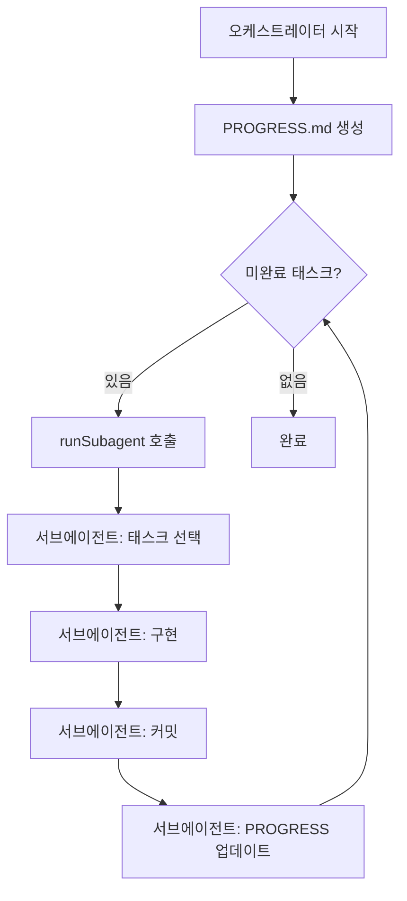

# Ralph Wiggum 기법 가이드

## 목차
1. [소개](#소개)
2. [핵심 개념](#핵심-개념)
3. [프로젝트 구조](#프로젝트-구조)
4. [파일 포맷](#파일-포맷)
5. [사용 방법](#사용-방법)
6. [프롬프트 엔지니어링](#프롬프트-엔지니어링)
7. [비용 절약 효과](#비용-절약-효과)
8. [모범 사례](#모범-사례)
9. [문제 해결](#문제-해결)

---

## 소개

**Ralph Wiggum 기법**은 VS Code Copilot Chat의 `runSubagent` 도구를 활용하여 대규모 프로젝트를 자동으로 구현하는 오케스트레이션 패턴입니다. 

### 핵심 아이디어

- **오케스트레이터**: Opus 모델을 사용하는 메인 에이전트. 전체 작업을 관리하고 서브에이전트를 순차적으로 호출
- **서브에이전트**: 각각 독립적으로 실행되며 단일 태스크만 구현
- **상태 공유**: `PROGRESS.md` 파일을 통해 진행 상황 추적

### 왜 이 기법을 사용하는가?

1. **비용 절약**: 오케스트레이터 1회 = 1 프리미엄 요청, `runSubagent` 호출은 추가 과금 없음
2. **컨텍스트 분리**: 각 서브에이전트가 독립적 → "message too big" 에러 방지
3. **안정성**: 서브에이전트가 실패해도 오케스트레이터가 다시 시도 가능
4. **추적 가능성**: 모든 진행 상황이 파일에 기록됨

---

## 핵심 개념

### 3요소 시스템

```
PLAN.md         → 프로젝트 전체 명세 (Single Source of Truth)
tasks/*.md      → 개별 작업 정의 (의존성, 완료 조건 포함)
PROGRESS.md     → 실시간 진행 추적 (오케스트레이터 ↔ 서브에이전트 통신)
```

### 워크플로우



---

## 프로젝트 구조

### 폴더 레이아웃

```
프로젝트루트/
├── .ai/                              # 오케스트레이터 메타 파일
│   ├── PLAN.md                       # PRD - 프로젝트 명세
│   ├── PROGRESS.md                   # 진행 추적 (자동 생성/업데이트)
│   ├── PROMPT_ORCHESTRATOR.md        # 오케스트레이터용 프롬프트
│   ├── PROMPT_SUBAGENT.md            # 서브에이전트용 프롬프트
│   ├── GUIDE.md                      # 이 가이드 (한글)
│   ├── GUIDE-EN.md                   # 이 가이드 (영어)
│   └── tasks/                        # 태스크 분할
│       ├── TASK-01-주제.md
│       ├── TASK-02-주제.md
│       └── ...
│
├── src/                              # 실제 앱 코드 (서브에이전트가 생성)
│   └── ...
│
└── (기타 프로젝트 파일)
```

### 파일 역할

| 파일 | 역할 | 생성 주체 | 업데이트 주체 |
|------|------|-----------|---------------|
| `PLAN.md` | 프로젝트 전체 요구사항 정의 | 사용자/Claude | - |
| `tasks/*.md` | 개별 태스크 상세 명세 | 사용자/Claude | - |
| `PROGRESS.md` | 실시간 진행 상황 | 오케스트레이터 | 서브에이전트 |
| `PROMPT_*.md` | 프롬프트 템플릿 | 사용자 | - |

---

## 파일 포맷

### 1. PLAN.md (PRD)

프로젝트의 **단일 진실 소스**. 서브에이전트가 컨텍스트를 이해하기 위한 문서.

```markdown
# {프로젝트명} — Product Requirements Document

## Overview
{프로젝트 개요 및 목적}

## Tech Stack
- Runtime: ...
- Language: ...
- Framework: ...

## Data Model
{핵심 데이터 구조}

## Functional Requirements
### Commands/Features
| 기능 | 설명 | 예시 |
|------|------|------|
| ... | ... | ... |

## Non-Functional Requirements
- 에러 처리
- 성능 요구사항
- 보안

## Project Structure
{예상 폴더/파일 구조}

## Coding Conventions
- 모듈 시스템 (ESM/CJS)
- 타입 안정성
- 커밋 메시지 규칙
```

### 2. tasks/TASK-XX-주제.md

각 태스크는 **SMART 원칙**(Specific, Measurable, Achievable, Relevant, Time-bound)을 따릅니다.

```markdown
# TASK-XX: {제목}

## Status: pending | in-progress | completed

## Dependencies: [TASK-YY, TASK-ZZ, ...]

## Description
{무엇을 구현해야 하는지 상세 설명}

## Acceptance Criteria
- [ ] 기준 1
- [ ] 기준 2
- [ ] 기준 3

## Files to Create/Modify
- `경로/파일1.ext`
- `경로/파일2.ext`

## Notes (선택)
{추가 주의사항, 참고 링크 등}
```

**태스크 분할 원칙:**
- 각 태스크는 30분~2시간 내 완료 가능한 크기
- 명확한 입력/출력 정의
- 의존성 그래프가 명확해야 함 (순환 참조 불가)
- 병렬 처리 가능한 태스크는 의존성을 독립적으로

### 3. PROGRESS.md

오케스트레이터가 초기 생성, 서브에이전트가 완료 시 업데이트.

```markdown
# Progress

## Task Status

| Task | Title | Status | Commit |
|------|-------|--------|--------|
| TASK-01 | 주제 | pending/completed | 커밋 메시지 또는 - |
| TASK-02 | 주제 | pending/completed | 커밋 메시지 또는 - |

## Log
- **YYYY-MM-DD** — TASK-XX completed: {상세 설명}
```

**상태 값:**
- `pending`: 아직 시작 안 함
- `in-progress`: (선택) 현재 작업 중
- `completed`: 완료 및 커밋됨

---

## 사용 방법

### 1단계: 프로젝트 설계

```bash
# 1. Git 초기화
git init
git branch -M main

# 2. .ai/ 폴더 및 기본 파일 생성
mkdir -p .ai/tasks
touch .ai/PLAN.md
touch .ai/PROMPT_ORCHESTRATOR.md
touch .ai/PROMPT_SUBAGENT.md
```

**PLAN.md 작성 팁:**
- Claude Sonnet에게 "다음 프로젝트의 PRD를 작성해줘: {아이디어}"로 초안 생성
- 기술 스택, 데이터 모델, 기능 요구사항을 명확히
- 코딩 컨벤션 명시 (ESM/CJS, strict 모드, 커밋 규칙 등)

### 2단계: 태스크 분할

Claude Sonnet에게 다음과 같이 요청:

```
아래 PLAN.md를 보고 10~20개의 태스크로 분할해줘.
각 태스크는 TASK-XX-주제.md 포맷으로 작성해줘.
의존성 그래프를 고려해서 순차/병렬 실행 가능하게 설계해줘.

{PLAN.md 내용 붙여넣기}
```

### 3단계: 프롬프트 템플릿 작성

[PROMPT_ORCHESTRATOR.md](./PROMPT_ORCHESTRATOR.md)와 [PROMPT_SUBAGENT.md](./PROMPT_SUBAGENT.md) 참조.

### 4단계: 오케스트레이터 실행

**VS Code Copilot Chat에서:**

1. **New Chat** 시작 (Opus 모델 선택 권장)
2. `PROMPT_ORCHESTRATOR.md` 내용 복사하여 붙여넣기
3. 엔터 — 오케스트레이터가 자동으로 루프 시작

**실행 중 동작:**
```
[Orchestrator] PROGRESS.md 생성...
[Orchestrator] 루프 1 시작 — runSubagent 호출
  [Subagent] TASK-01 선택 → 구현 → 커밋 → PROGRESS 업데이트
[Orchestrator] PROGRESS 확인 → 9개 태스크 남음
[Orchestrator] 루프 2 시작 — runSubagent 호출
  [Subagent] TASK-02 선택 → 구현 → 커밋 → PROGRESS 업데이트
...
[Orchestrator] 모든 태스크 완료 — 종료
```

### 5단계: 모니터링 및 개입

- **PROGRESS.md 실시간 확인**: 어떤 태스크가 완료되었는지 추적
- **Git 커밋 로그**: `git log --oneline`으로 진행 상황 확인
- **필요 시 일시 정지**: `PAUSE.md` 파일 생성 (아래 참조)

---

## 프롬프트 엔지니어링

### 오케스트레이터 프롬프트 핵심 요소

```markdown
<PLAN>경로/PLAN.md</PLAN>
<TASKS>경로/tasks/</TASKS>
<PROGRESS>경로/PROGRESS.md</PROGRESS>

<ORCHESTRATOR_INSTRUCTIONS>
당신은 오케스트레이션 에이전트입니다.

1. PROGRESS.md가 없으면 생성 (모든 태스크를 pending으로)
2. 구현 루프:
   - runSubagent 호출 with <SUBAGENT_PROMPT>
   - 서브에이전트 완료 대기
   - PROGRESS.md 읽기
   - 미완료 태스크 확인
   - 있으면 다시 runSubagent 호출
   - 없으면 루프 종료
3. 직접 코딩하지 않음 — 관리만 수행

**중요:**
- runSubagent 도구가 없으면 즉시 실패 알림
- 각 반복마다 PROGRESS.md를 읽어 진행 상황 확인
- 모든 태스크가 completed일 때만 종료
</ORCHESTRATOR_INSTRUCTIONS>
```

### 서브에이전트 프롬프트 핵심 요소

```markdown
<SUBAGENT_INSTRUCTIONS>
당신은 시니어 소프트웨어 엔지니어 코딩 에이전트입니다.

PROJECT ROOT: {실제 경로}
PLAN: .ai/PLAN.md
PROGRESS: .ai/PROGRESS.md
TASKS: .ai/tasks/

작업 순서:
1. PLAN, PROGRESS, 모든 TASK 파일 읽기
2. 의존성을 고려해 가장 중요한 미완료 태스크 1개 선택
   - 의존성이 충족되지 않은 태스크는 선택 불가
3. 선택한 태스크만 완전히 구현
4. 검증 (빌드/테스트 실행)
5. PROGRESS.md 업데이트
   - 상태를 completed로 변경
   - Log 섹션에 상세 기록 추가
6. Git 커밋 (conventional commit 형식)
7. 완료 내용 보고 후 종료

**중요:**
- 한 번에 1개 태스크만 구현
- 의존성 확인 필수
- PROGRESS 업데이트 필수
- 커밋 메시지는 간결하고 임팩트 중심
</SUBAGENT_INSTRUCTIONS>
```

### 프롬프트 최적화 팁

**DO:**
- 경로는 절대 경로 또는 명확한 상대 경로 사용
- 서브에이전트에게 "하나씩" 강조
- 의존성 검사 로직 명시
- 실패 시 에러 메시지 명확히

**DON'T:**
- 모호한 지시어 (e.g., "적절히", "가능하면")
- 너무 많은 선택지 제공 (서브에이전트가 혼란)
- PROGRESS 업데이트 누락 허용

---

## 비용 절약 효과

### 기존 방식 vs Ralph Wiggum

| 항목 | 기존 (단일 Opus 세션) | Ralph Wiggum |
|------|----------------------|--------------|
| 프리미엄 요청 | 10~50회+ | 1~3회 |
| 컨텍스트 오버플로우 | 높음 | 낮음 (서브에이전트 독립) |
| 재시도 비용 | 높음 (전체 재실행) | 낮음 (실패 태스크만) |
| 추적 가능성 | 낮음 | 높음 (PROGRESS.md) |

### 실제 사례 (Todo CLI 프로젝트)

- **태스크 수**: 10개
- **프리미엄 요청**: 1회 (오케스트레이터)
- **서브에이전트 호출**: 10회 (추가 비용 없음)
- **실행 시간**: 약 2시간 (자율 실행)
- **커밋 수**: 10개 (각 태스크당 1개)

---

## 모범 사례

### 1. 태스크 분할

**좋은 예:**
```
TASK-01: 프로젝트 초기화 (package.json, tsconfig.json, .gitignore)
TASK-02: 데이터 모델 정의 (Todo 인터페이스)
TASK-03: 스토리지 레이어 (JSON 파일 CRUD)
```

**나쁜 예:**
```
TASK-01: 전체 앱 구현 (너무 큼)
TASK-02: 프론트엔드와 백엔드 연동 (의존성 불명확)
```

### 2. PLAN.md 작성

**좋은 예:**
- 명확한 기술 스택 명시
- 데이터 모델을 코드 블록으로 제시
- 각 기능의 입력/출력 정의

**나쁜 예:**
- "적절한 프레임워크 사용" (모호함)
- "좋은 코드 작성" (측정 불가)

### 3. 의존성 관리

```markdown
# 병렬 가능
TASK-04: Add 커맨드 (의존: TASK-03)
TASK-05: List 커맨드 (의존: TASK-03)
TASK-06: Update 커맨드 (의존: TASK-03)
TASK-07: Delete 커맨드 (의존: TASK-03)

# 순차 필수
TASK-08: CLI 진입점 (의존: TASK-04, 05, 06, 07)
```

### 4. 점진적 검증

각 태스크 완료 후:
- `npm run build` 또는 `npm test` 실행
- 컴파일 에러 확인
- 간단한 수동 테스트 (CLI 실행 등)

---

## 문제 해결

### Q1. 서브에이전트가 잘못된 태스크를 선택한 경우

**해결:**
1. 오케스트레이터에게 "TASK-XX의 의존성이 완료되지 않았으니 다시 선택해줘" 요청
2. 또는 PROGRESS.md를 수동으로 수정하여 올바른 태스크를 pending으로 표시

### Q2. "Rate limit" 에러 발생

**원인**: 오케스트레이터가 너무 많은 요청을 짧은 시간에 수행

**해결:**
1. 몇 시간 대기 후 "Retry" 버튼 클릭
2. 또는 `PAUSE.md` 파일 생성하여 오케스트레이터 일시 정지

### Q3. 특정 태스크에서 반복 실패

**해결:**
1. 해당 태스크를 `TASK-XX-주제-REVISED.md`로 수정 (더 구체적으로)
2. PROGRESS.md에서 해당 태스크를 pending으로 되돌림
3. 오케스트레이터 재시작

### Q4. PROGRESS.md 업데이트 누락

**증상**: 서브에이전트가 구현했지만 PROGRESS에 반영 안 됨

**해결:**
- 수동으로 PROGRESS.md 수정
- 다음 서브에이전트 프롬프트에 "PROGRESS 업데이트 필수" 강조

### Q5. 컨텍스트 오버플로우 ("message too big")

**원인**: PLAN.md 또는 TASK 파일이 너무 긺

**해결:**
- PLAN.md를 핵심만 남기고 축약
- 긴 코드 예시는 외부 링크로 대체
- 태스크를 더 작은 단위로 분할

---

## 고급 기능

### PAUSE 파일 활용

오케스트레이터를 일시 정지하고 사용자가 개입할 수 있는 메커니즘:

```markdown
# .ai/PAUSE.md

## Reason
서브에이전트가 TASK-05에서 반복 실패 중. 수동으로 디버깅 필요.

## Actions Needed
- [ ] TASK-05를 더 작은 태스크로 분할
- [ ] 의존성 재검토

## Resume Instructions
이 파일을 삭제하면 오케스트레이터가 자동으로 재개됩니다.
```

**오케스트레이터 프롬프트에 추가:**
```markdown
각 루프 시작 시 PAUSE.md 파일 존재 확인.
- 있으면: "⏸️ PAUSE.md 발견. 파일을 삭제하면 재개됩니다." 출력 후 대기
- 없으면: 정상 진행
```

### 동적 태스크 추가

서브에이전트가 작업 중 새로운 태스크가 필요하다고 판단한 경우:

```markdown
# 서브에이전트 프롬프트에 추가
구현 중 새로운 태스크가 필요하면:
1. .ai/tasks/TASK-XX-새주제.md 파일 생성
2. PROGRESS.md에 새 태스크 행 추가 (pending 상태)
3. Log에 "TASK-XX 추가됨: {이유}" 기록
```

---

## 체크리스트

### 시작 전
- [ ] `.ai/` 폴더 생성
- [ ] `PLAN.md` 작성 완료
- [ ] 모든 `TASK-XX-*.md` 파일 작성
- [ ] 의존성 그래프 검증 (순환 참조 없음)
- [ ] `PROMPT_ORCHESTRATOR.md` 준비
- [ ] `PROMPT_SUBAGENT.md` 준비
- [ ] Git 저장소 초기화

### 실행 중
- [ ] PROGRESS.md 실시간 모니터링
- [ ] Git 커밋 로그 확인
- [ ] 빌드 에러 발생 시 즉시 대응
- [ ] 필요 시 PAUSE.md 생성

### 완료 후
- [ ] 모든 태스크 completed 확인
- [ ] 최종 빌드/테스트 통과
- [ ] README.md 작성 또는 업데이트
- [ ] Git 태그 생성 (e.g., `v1.0.0`)

---

## 참고 자료

- [원문 Discussion](https://github.com/orgs/community/discussions) — Ralph Wiggum 기법 최초 제안
- [VS Code Copilot Documentation](https://code.visualstudio.com/docs/copilot)
- [Conventional Commits](https://www.conventionalcommits.org/)
- 이 프로젝트의 `.ai/tasks/` — 실제 태스크 분할 예시

---

## 라이선스

이 가이드는 MIT 라이선스를 따릅니다. 자유롭게 수정 및 배포 가능합니다.

---

**Happy Orchestrating! 🎭**
